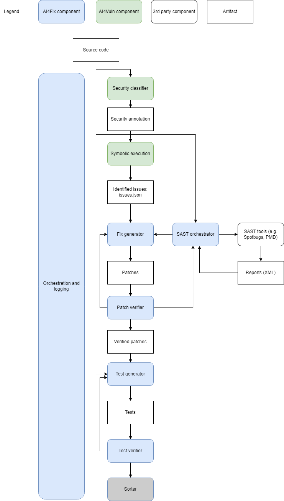

# AI4Framework Guide

## Introduction

AI4Framework is designed to enhance software development processes through the power of artificial intelligence. This framework combines various tools and technologies to provide comprehensive code analysis, vulnerability detection, and automated bug fixing capabilities. By leveraging static code analysis, symbolic execution, and so much more, AI4Framework aims to improve code quality, identify potential security risks, and streamline the development workflow.



Key features of AI4Framework include:
- Automated code analysis using static analysis tools, such as **PMD 7.4.0**, and **Spotbugs 4.8.6**.
- Vulnerability scanning for both code and dependencies
- **RTEHunter**, a symbolic execution tool for deep code inspection
- Integration with many models such as **OpenAI's GPT models** for intelligent code understanding and suggestion generation
- Customizable configuration to fit various project requirements

This guide provides detailed instructions on how to set up and use the framework. Follow each step carefully to ensure a smooth development process, maximizing the benefits of AI4Framework.

## Table of Contents

1. [Prerequisites](#prerequisites)
2. [Setting Up the Framework](#setting-up-the-framework)
3. [Configuration File](#configuration-file)
4. [Orchestration](#orchestration)
5. [Analyzing Your Project](#analyzing-your-project)
    - [Option 1: Using the Built-in Editor](#option-1-using-the-built-in-editor)
    - [Option 2: Using Command Line Access (Headless Mode)](#option-2-using-command-line-access-headless-mode)
10. [Example Scenario: Running AI4Framework on macOS in Headless Mode](#example-scenario-running-ai4framework-on-macos-in-headless-mode)
    - [Reviewing and Retrieving the Results](#reviewing-and-retrieving-the-results)
11. [Need Support?](#need-support)

---

## Prerequisites

Ensure your system meets the following requirements before proceeding:

- **Operating System**: Windows, Linux, or macOS
- **Docker**: Installed and running ([Download Docker](https://www.docker.com/get-started))
- **Git and Git LFS**: Installed ([Download Git](https://git-scm.com/downloads), [Download Git LFS](https://git-lfs.github.com/))
  - **Important**: AI4Framework contains large files managed by Git LFS. However some files exceed the maximum data quota of the repository. **Make sure to download the `slab-9.19-d45fdf7b5.tgz` file manually, from the latest Release Assets.**
- **A pre prepared Project**: Currently our framework only supports **maven, gradle and javac**. Your project should be organized with one of them, and should use **Java 11 or below**.
- **API Key**: At the moment, AI4Framework utilizes OpenAI's GPT models, Groq's models and Anthropic's Claude models, requiring an API key for access. ([OpenAI](https://platform.openai.com/signup), [Groq](https://console.groq.com/login), [Anthropic](https://claude.ai/onboarding))

---

## Setting Up the Framework

### Step 1: Clone the AI4Framework Repository

Ensure Git LFS is installed and initialized:

```bash
git lfs install
```

Clone the repository:

```bash
git clone --branch release-v1.0.0 --single-branch https://github.com/ai4cyber-slab/ai4fix.git
```

If Git LFS does not retrieve large files automatically, navigate to the `ai4framework` directory and run:

```bash
git lfs pull
```

**Important**: Some large files exceed the maximum data quota of the repository. Because of that, **make sure to download the `slab-9.19-d45fdf7b5.tgz` file manually, from the latest Release Assets, and copy it into the `ai4framework` folder**.

Ensure that the files are placed in the correct locations to avoid any issues when running the framework.

### Step 2: Navigate to the AI4Framework Directory

```bash
cd ai4framework
```

---

## Configuration File

You don’t need to manually create the configuration file! After you run the Docker container, the process will handle everything for you, including creating the required `config.properties` from a template in the root of the `ai4framework` directory. Simply execute the appropriate script for your operating system and follow the instructions provided.

For reference, the content of the `config.properties` template is as follows:

```properties
[DEFAULT]
config.filter=test # packages/folders to filter files (if present in file paths, those files will be ignored). Leave empty to analyze all files.
config.rounds_count=1 # Number of times to run the process. Useful for auto patching with '--auto' option.
config.build_tool=maven # (maven, gradle, or javac)

[API]
config.provider=azureopenai # Service to use ('groq', 'openai', 'claude', 'azureopenai')
config.key=your_api_key # Enter your API key directly
config.azure_endpoint=https://xxxxxx.azure.com/openai/deployments/xxxxxx
config.azure_api_version=2024-08-01-preview
config.model=gpt-4 # Desired model name
config.temperature=0 # Desired temperature

[SAST]
config.pmd_ruleset=/app/utils/PMD-config.xml # Leave as default or change if needed

[PLUGIN]
plugin.use_diff_mode=view Diffs # Do not change
plugin.script_path=/app # Do not change
plugin.rerun_analysis_after_patch=onOverlap # Values: 'always' = re-run analysis after every patch 'onOverlap' = only re-run analysis if the patch had overlapping issues
```

---

## Orchestration

Before we continue, let's take a look at the analysis script.
You can customize it by providing various command-line arguments.

### Usage

```bash
python /app/orchestrator.py [options]
```

### Options

- **`-h`, `--help`**: Show help message and exit.
- **`-c COMMIT_SHA`, `--commit_sha COMMIT_SHA`**: Analyze only files changed in the specified commit.
- **`--skip-patches`**: Perform analysis without generating patches.
- **`--sast-rerun`**: Run static analysis tools only.
- **`--auto`**: Automatically apply generated patches to your code.

### Examples

- **Analyze the Entire Project**

  ```bash
  python /app/orchestrator.py
  ```

- **Analyze Files Changed in a Specific Commit**

  ```bash
  python /app/orchestrator.py -c <commit_sha>
  ```

- **Analyze Without Generating Patches**

  ```bash
  python /app/orchestrator.py --skip-patches
  ```

- **Run Static Analysis Tools Only**

  ```bash
  python /app/orchestrator.py --sast-rerun
  ```

- **Automatically Apply Patches**

  ```bash
  python /app/orchestrator.py --auto
  ```

---

## Analyzing Your Project

After setting everything up, you are ready to run your Docker container. You have two options to proceed:

### Option 1: Using the Built-in Editor

This method lets you use a web-based code editor similar to **Visual Studio Code**.

#### On Windows

1. Open PowerShell: Press `Win + X` and select **Windows PowerShell**.

2. Run the following command:

```powershell
.\ai4framework_entry.ps1 -LOCAL_PROJECT_PATH "C:\path\to\your\project" -CONTAINER_PROJECT_PATH "/project" [-PORT 8080] [-MavenVersion "3.9.5"] [-GradleVersion "7.6"]
```
Replace the placeholders with your information:
- **`-LOCAL_PROJECT_PATH`**: Full path to your project folder.
- **`-CONTAINER_PROJECT_PATH`**: Path inside the container (you can leave it as `/project`).
- **`-PORT` (Optional)**: Port number. Defaults to 8080.
- **`-MavenVersion` (Optional)**: The maven version of your project. Defaults to 3.9.5
- **`-GradleVersion` (Optional)**: The gradle version of your project. Defaults to 7.6

#### On Linux or macOS

1. Open Terminal

2. Run the following command:

```bash
bash ai4framework_entry.sh --LOCAL_PROJECT_PATH "/path/to/your/project" --CONTAINER_PROJECT_PATH "/project" [--PORT 8080] [--MavenVersion "3.9.5"] [-GradleVersion "7.6"]
```
Replace the placeholders with your information:
- **`-LOCAL_PROJECT_PATH`**: Full path to your project folder.
- **`-CONTAINER_PROJECT_PATH`**: Path inside the container (you can leave it as `/project`).
- **`-PORT` (Optional)**: Port number. Defaults to 8080.
- **`-MavenVersion` (Optional)**: The maven version of your project. Defaults to 3.9.5
- **`-GradleVersion` (Optional)**: The gradle version of your project. Defaults to 7.6

**Important**: You only have to provide one of the version arguments. If you decide to use javac, don't provide any of the version parameters, but make sure to organize your java files under a `src/main/java` folder.

#### Access the Web Editor

- After running Docker, look for a message like:

  ```
  Container is running with code-server support. Navigate to http://localhost:XXXX/?folder=/*
  ```

- Open your web browser and go to that address.

#### Open the Terminal in the Editor

- In the web editor, click on **Terminal** > **New Terminal**.

#### Run the Analysis

- In the terminal, type:

  ```bash
  python /app/orchestrator.py
  ```

- Press **Enter**.

---

### Option 2: Using Command Line Access (Headless Mode)

If you prefer using the command line without the web editor, run Docker with an additional argument to get direct access to the container's terminal.

#### Step 1: Run Docker with Bash Access

**On Windows:**

```powershell
.\ai4framework_entry.ps1 -LOCAL_PROJECT_PATH "C:\path\to\your\project" -CONTAINER_PROJECT_PATH "/project" -PORT 8080 -RunWithBash
```

**On Linux or macOS:**

```bash
bash ai4framework_entry.sh --LOCAL_PROJECT_PATH "/path/to/your/project" --CONTAINER_PROJECT_PATH "/project" --PORT 8080 --RunWithBash
```

#### Step 2: Run the Analysis Inside the Container

The analysis and process will directly start when the config file is modified, and `y` for yes is typed followed by pressing Enter.

#### Step 3: (Optional) Open Code-Server Support  

If you decide to open code-server support after the end of the analysis, you can do so by running the following command inside the container:  

```bash
code-server --bind-addr 0.0.0.0:8080 --auth none /project
```  

- Replace `8080` with the port already in use if applicable.  
- `/project` is the path within the container to your project directory.


---

## Example Scenario: Running AI4Framework on macOS in Headless Mode

Suppose you want to:

- Use **macOS**.
- Deploy AI4Framework in headless mode.
- Analyze the entire project folder.
- Use port **9090** because port 8080 is already in use.
- Obtain all **warnings and patches**.

### Steps

#### Step 1: Open Terminal

#### Step 2: Navigate to the AI4Framework Directory

```bash
cd ai4framework
```

#### Step 3: Prepare Your Project

Ensure your project supports one of the required structure, listed in the [Prerequisites](#prerequisites) section. In this case, your project is located at `/path/to/your/project`.

#### Step 4: Create the `config.properties` File

The script below eliminates the need for manual copying or file creation. When you run the script, it will automatically create the `config.properties` file inside the `ai4framework` folder based on the `config_template.properties`. You will only need to provide appropriate values for your specific setup when prompted by the script, and that's it. No additional manual steps are required. See the [Configuration File](#configuration-file) section for details.

#### Step 5: Run Docker with Bash Access and Custom Port

```bash
bash ai4framework_entry.sh --LOCAL_PROJECT_PATH "/path/to/your/project" --CONTAINER_PROJECT_PATH "/project" --PORT 9090 --RunWithBash
```

#### Step 6: Run the Analysis Inside the Container

The analysis and process will directly start when the config file is modified, and `y` for yes is typed followed by pressing Enter.

### Reviewing and Retrieving the Results

After the analysis, AI4Framework creates a hidden `.ai4framework` folder in your project directory containing:

- **patches**: Validated `.diff` files with suggested fixes.
- **symbolic_results**: Issues found by the symbolic execution tool.
- **validation**: Details about issues found and suggested patches.
- **visualizations**: Statistics like the number of issues found/fixed, token consumption, etc.
- **issues.json**: A file listing all issues and suggested fixes.
- **sast_issues**: Issues found by static analysis tools.
- **jsons.lists**: Paths to the validated JSON files.

Back in your Mac terminal (outside the container), copy the results from the container to your local computer.
First, find the container ID by running:

```bash
docker ps -a
```

Note the container ID associated with AI4Framework.

Copy the `.ai4framework` folder from the container to your chosen directory:

```bash
docker cp <container_id>:/project/.ai4framework "/Users/username/path/to/chosen/directory"
```

Replace `<container_id>` with the actual container ID.

---

## Need Support?

If you have questions or need help:

- Visit the [GitHub repository](https://github.com/ai4cyber-slab/ai4fix) and check the issues section.
- Contact the maintainers through the repository.

---

Thank you for choosing **AI4Framework** to improve your code! We're here to help you make your projects better and more secure.