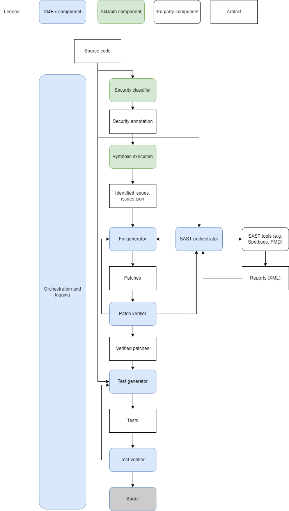

# AI4Framework Guide

## Introduction

AI4Framework is designed to enhance software development processes through the power of artificial intelligence. This framework combines various tools and technologies to provide comprehensive code analysis, vulnerability detection, and automated bug fixing capabilities. By leveraging static code analysis, symbolic execution, and so much more, AI4Framework aims to improve code quality, identify potential security risks, and streamline the development workflow.



Key features of AI4Framework include:
- Automated code analysis using multiple static analysis tools
- Vulnerability scanning for both code and dependencies
- Symbolic execution for deep code inspection
- Integration with many models such as OpenAI's GPT models for intelligent code understanding and suggestion generation
- Customizable configuration to fit various project requirements

This guide provides detailed instructions on downloading necessary tools and configuring the `config.properties` file. Follow each step carefully to ensure a smooth setup and maximize the benefits of AI4Framework in your development process.

## Table of Contents

1. [Prerequisites](#prerequisites)
2. [Git](#1-git)
3. [Python and Python Libraries](#2-python-and-python-libraries)
4. [OpenAI API Key](#3-openai-api-key)
5. [Maven](#4-maven)
6. [Static Tools: PMD](#5-static-tools-pmd)
7. [Static Tools: SpotBugs](#6-static-tools-spotbugs)
8. [Vulnerability Scanner: Trivy](#7-vulnerability-scanner-trivy)
9. [Java Development Kit (JDK)](#8-java-development-kit-jdk)
10. [Symbolic Execution Tool: RTEHunter](#9-symbolic-execution-tool-rtehunter)
11. [Building and Running AI4Framework with Code-Server using Docker](#building-and-running-ai4framework-with-code-server-using-docker)
12. [Final Notes](#final-notes)

---

## Prerequisites

Ensure your system meets the following requirements before proceeding:

- **Operating System**: Windows, Linux
- **Administrative Privileges**: Required for installing software and setting environment variables

---

## 1. Git

**Git** is a distributed version control system essential for managing your project's source code.

### Download

- **Git for Windows**: [Link](https://git-scm.com/download/win)
- **Git for Linux**: Typically available via package managers (e.g., `apt`, `brew`)

---

## 2. Python and Python Libraries

Python is required to run various components of the AI4Framework.

### Download

- **Python 3.9 or Later**: [Link](https://www.python.org/downloads/)

---

### 2.1. Install Python Libraries

Install libraries using `requirements.txt` file that will be provided within your project directory.

### Usage

- `pip install -r requirements.txt`

---

## 3. OpenAI API Key

At the moment, AI4Framework utilizes OpenAI's GPT models, requiring an API key for access, but more models will be added soon.

### Access

- **OpenAI Sign Up**: [Link](https://platform.openai.com/signup)

### Configuration

Add your OpenAI API key as an environment variable. Update your `.env` file or system environment variables accordingly.
```properties
OPENAI_API_KEY='your_api_key_here'
```

---

## 4. Maven

**Maven** is a build automation tool primarily used for Java projects.

### Download

- **Apache Maven**: [Link](https://maven.apache.org/download.cgi)


---

## 5. Static Tools: PMD

**PMD** is a static code analysis tool for identifying potential issues in Java code.

### Download

- **PMD 7.4.0**: [Link](https://github.com/pmd/pmd/releases)

### Configuration in `config.properties`

Set the PMD binary and ruleset paths:

```properties
config.pmd_bin=/path/to/pmd/bin/pmd
config.pmd_ruleset=/path/to/your/ruleset.xml
```

---

## 6. Static Tools: SpotBugs

**SpotBugs** is a static analysis tool for Java that detects bugs in your code.

### Download

- **SpotBugs 4.8.6**: [Link](https://github.com/spotbugs/spotbugs/releases)

### Configuration in `config.properties`

Set the SpotBugs binary path:

```properties
config.spotbugs_bin=/path/to/spotbugs/bin/spotbugs
```

---

## 7. Vulnerability Scanner: Trivy

**Trivy** is a comprehensive vulnerability scanner for containers and artifacts.

### Download

- **Trivy 0.54.1**: [Link](https://github.com/aquasecurity/trivy/releases)

### Configuration in `config.properties`

Set the Trivy binary path:

```properties
config.trivy_bin=/path/to/trivy
```

---

## 8. Java Development Kit (JDK)

The **Java Development Kit (JDK)** is essential for compiling and running Java applications within the AI4Framework.

### Download

- **JDK 11**: [Link](https://www.oracle.com/java/technologies/javase/jdk11-archive-downloads.html)


---

## 9. Symbolic Execution Tool: RTEHunter

**RTEHunter** is a symbolic execution tool that enhances the AI4Framework's ability to detect vulnerabilities.

### Download

- **RTEHunter Binary**: [Link to be added Later](https://github.com/AI4VULN/RTEHunter/releases)

### Configuration in `config.properties`

Set the analyzer paths and results path:

```properties
config.analyzer=/path/to/AI4VULN-analyzer
config.analyzer_path=/path/to/AI4VULN
config.analyzer_results_path=/path/to/results/
```

---

## `config.properties` Example

Below is a sample `config.properties` file. Update the paths according to your system setup.

```properties
[DEFAULT]
config.project_name=user_project #change to specified project name directory in container
config.project_path=/user_project #change to specified project directory in container
config.results_path=/user_project/patches #change to specified project directory in container
config.spotbugs_bin=/opt/spotbugs-4.8.6/bin/spotbugs # do not change
config.pmd_bin=/opt/pmd-bin-7.4.0/bin/pmd # do not change
config.pmd_ruleset=/app/utils/PMD-config.xml # change or leave the default
config.trivy_bin=/usr/bin/trivy # do not change
config.jsons_listfile=/user_project/jsons.lists # change to specified project directory in container
[CLASSIFIER]
commit_sha=2f7bb20317500db89c1bc2c0d96275e09f3c62a1 # change to desired commit hash
gpt_model=gpt-4o # desired model
temperature=0
[ISSUES]
config.issues_path=/user_project/issues.json #change to specified project directory in container
[REPORT]
config.pmd_report_path=/app/sast/out/pmd.xml 
config.spotbugs_report_path=/app/sast/out/spotbugs.xml
config.trivy_report_path=/app/sast/out/trivy.json
[ANALYZER]
config.analyzer=/opt/AI4VULN/Java/AnalyzerJava # do not change
config.analyzer_path=/opt/AI4VULN # do not change
config.analyzer_results_path=/user_project/results
# Vscode-Plugin settings
[PLUGIN]
plugin.use_diff_mode=view Diffs
plugin.executing_parameters=ls # do not change
plugin.executable_path=/user_project/target #change to specified project directory in container
plugin.script_path=/app # do not change
plugin.test_folder_log=/user_project/src/test # change if needed
```

---

## Building and Running AI4Framework with Code-Server using Docker

Follow the steps below to set up AI4Framework in a Docker container with code-server. This will allow you to perform code analysis and vulnerability scanning, along with using tools like PMD, SpotBugs, and Trivy, and potentially OpenAI's GPT models for classification.
### Step 1: Install Git LFS

Before cloning the AI4Framework repository, ensure you have Git LFS (Large File Storage) installed on your system. This is necessary for handling large files that might be part of the repository. To install Git LFS, follow these steps:

For **Ubuntu/Debian**:
```bash
sudo apt update && sudo apt install git-lfs
```
For **Red Hat/CentOS**:
```bash
sudo yum install git-lfs
```
For **Mac (with Homebrew)**:
```bash
brew install git-lfs
```
For **Windows**, download and install Git LFS from the official website: <https://git-lfs.github.com/>

Once installed, initialize Git LFS:
```bash
git lfs install
```

### Step 2: Clone the Repository

First, clone the AI4Framework repository from your preferred Git hosting service (e.g., GitHub, GitLab):

```bash
git clone --branch dev https://github.com/ai4cyber-slab/ai4fix.git
```

### Step 3: Navigate to the AI4Framework Directory

Once the repository is cloned, navigate to the `ai4framework` directory:

```bash
cd ai4framework
```

### Step 4: Build the Docker Image

To build the Docker image that includes code-server and all necessary tools, use the following command. You can name the image as desired (in this example, we use `code-analyzer-vs-version`):

```bash
docker build -t code-analyzer-vs-version .
```

Make sure to replace `code-analyzer-vs-version` with your desired image name if needed.

---
### Step 5: Run the Docker Container

Once the Docker image is built, you can create and run the container. If you don't provide the `OPENAI_API_KEY`, the classification part will be skipped when running the Python script later. It's essential to note that the `PROJECT_PATH` environment variable should always point to the directory that contains the `.git` directory of your project.

Here's the command to run the container with code-server support:

```bash
docker run -it -p 8080:8080 -e OPENAI_API_KEY='sk-proj-....' -e PROJECT_PATH=/user_project -v C:/Users/HP/Music/Demo:/user_project code-analyzer-vs-version
```

#### Alternative: Running the Container without VS Code Support
If you prefer to interact with the container directly via Bash without needing code-server, simply add `bash` to the end of the second Docker command:

```bash
docker run -it -e OPENAI_API_KEY='sk-proj-....' -e PROJECT_PATH=/user_project -v C:/Users/HP/Music/Demo:/user_project code-analyzer-vs-version bash
```

Once inside the container, navigate to the project directory:

```bash
cd /user_project
```

Then run the analysis script:
```bash
python /app/orchestrator.py
```

#### Key Flags:
- `-p 8080:8080`: Exposes port 8080 for code-server access via a browser.
- `-e OPENAI_API_KEY=''`: You can leave this blank if you don't want to provide an OpenAI API key, or provide it if necessary.
- `-v C:/Users/HP/Music/Demo:/user_project`: Mounts the root directory of your project (e.g., a Maven project with multiple sub-projects) that contains the `.git` directory to the `/user_project` directory inside the container. For example, if you have a project like the Struts GitHub repository with multiple sub-projects, you would mount the Struts root directory. You can then specify the path to the desired subdirectory in the `config.properties` file.
- `-e PROJECT_PATH=/user_project`: Specifies the project directory within the container, which should point to the mounted root directory of your project. You will configure the specific subdirectory path in the `config.properties` file.


#### Important:
 You can name the directory inside the container (`/user_project`) however you want, but ensure you consistently use the same name throughout your workflow. This directory will hold your local project ( eg: `C:/Users/HP/Music/Demo:/user_project`) inside the Docker container.

### Step 6: Access Code-Server (only if you did not use the Docker Bash command alternative)

Once the container is running, open your web browser and go to the following URL to access code-server:

```
http://localhost:8080/?folder=/user_project
```

Make sure to replace `/user_project` with the correct project path inside the container if different.

### Step 7: Creating config.properties for the Project

Before running the Python script in VS Code for the project you want to analyze, you must create a config.properties file inside the project directory that contains the `.git` with the following content:
```properties
[DEFAULT]
config.project_name=user_project #change to specified project name directory in container
config.project_path=/user_project #change to specified project directory in container
config.results_path=/user_project/patches #change to specified project directory in container
config.spotbugs_bin=/opt/spotbugs-4.8.6/bin/spotbugs # do not change
config.pmd_bin=/opt/pmd-bin-7.4.0/bin/pmd # do not change
config.pmd_ruleset=/app/utils/PMD-config.xml # change or leave the default
config.trivy_bin=/usr/bin/trivy # do not change
config.jsons_listfile=/user_project/jsons.lists # change to specified project directory in container
[CLASSIFIER]
commit_sha=2f7bb20317500db89c1bc2c0d96275e09f3c62a1 # change to desired commit hash
gpt_model=gpt-4o # desired model
temperature=0
[ISSUES]
config.issues_path=/user_project/issues.json #change to specified project directory in container
[REPORT]
config.pmd_report_path=/app/sast/out/pmd.xml 
config.spotbugs_report_path=/app/sast/out/spotbugs.xml
config.trivy_report_path=/app/sast/out/trivy.json
[ANALYZER]
config.analyzer=/opt/AI4VULN/Java/AnalyzerJava # do not change
config.analyzer_path=/opt/AI4VULN # do not change
config.analyzer_results_path=/user_project/results
# Vscode-Plugin settings
[PLUGIN]
plugin.use_diff_mode=view Diffs
plugin.executing_parameters=ls # do not change
plugin.executable_path=/user_project/target #change to specified project directory in container
plugin.script_path=/app # do not change
plugin.test_folder_log=/user_project/src/test # change if needed
```


### Step 8: Run the Python Script

Now, open the VSCode terminal in code-server and run the Python script for analysis.

```bash
python /app/orchestrator.py
```

This will start the analysis process on your project.

---

By following these steps, you will be able to build and run the AI4Framework with code-server inside a Docker container, and conduct code analysis directly through the VSCode interface.

---
### Example: Analyzing a Big Project

Let's consider a big project like Apache Struts, which is hosted on GitHub. Here's how you can configure the `config.properties` file and the Docker commands to analyze a certain maven sub-project such as `core`.

#### `config.properties` Example

```properties
[DEFAULT]
config.project_name=core #change to specified project name directory in container
config.project_path=/user_project/core #change to specified project directory in container
config.results_path=/user_project/core/patches #change to specified project directory in container
config.spotbugs_bin=/opt/spotbugs-4.8.6/bin/spotbugs # do not change
config.pmd_bin=/opt/pmd-bin-7.4.0/bin/pmd # do not change
config.pmd_ruleset=/app/utils/PMD-config.xml # change or leave the default
config.trivy_bin=/usr/bin/trivy # do not change
config.jsons_listfile=/user_project/core/jsons.lists # change to specified project directory in container
[CLASSIFIER]
commit_sha=735d1bc88d9beceb18558d12f565a466f96a5b2a # change to desired commit hash
gpt_model=gpt-4o # desired model
temperature=0
[ISSUES]
config.issues_path=/user_project/core/issues.json #change to specified project directory in container
[REPORT]
config.pmd_report_path=/app/sast/out/pmd.xml 
config.spotbugs_report_path=/app/sast/out/spotbugs.xml
config.trivy_report_path=/app/sast/out/trivy.json
[ANALYZER]
config.analyzer=/opt/AI4VULN/Java/AnalyzerJava # do not change
config.analyzer_path=/opt/AI4VULN # do not change
config.analyzer_results_path=/user_project/core/results
# Vscode-Plugin settings
[PLUGIN]
plugin.use_diff_mode=view Diffs
plugin.executing_parameters=ls # do not change
plugin.executable_path=/user_project/core/target #change to specified project directory in container
plugin.script_path=/app # do not change
plugin.test_folder_log=/user_project/core/src/test # change if needed
```

#### Docker Commands

To build the Docker image for Apache Struts:

```bash
docker build -t code-analyzer-apache-struts .
```

To run the Docker container for Apache Struts, use the following command: in our case the holder of the `.git` is the struts repo root folder:

```bash
docker run -it -p 8080:8080 -e OPENAI_API_KEY='your_openapi_key' -e PROJECT_PATH=/user_project -v C:/Users/HP/Music/struts:/user_project code-analyzer-vs-version

```

These commands will build the Docker image and run the container for Apache Struts, allowing you to analyze the project with AI4Framework.


## Final Notes

### Troubleshooting

- **Common Issues**:
  - **Path Not Found Errors**:
    - Ensure all environment variables are correctly set.
    - Verify the paths in `config.properties` point to the correct locations.

- **Getting Help**:
  - Contact us at ...

### Updating the Framework

- Regularly pull the latest changes from the repository to stay updated with new features and fixes:

---